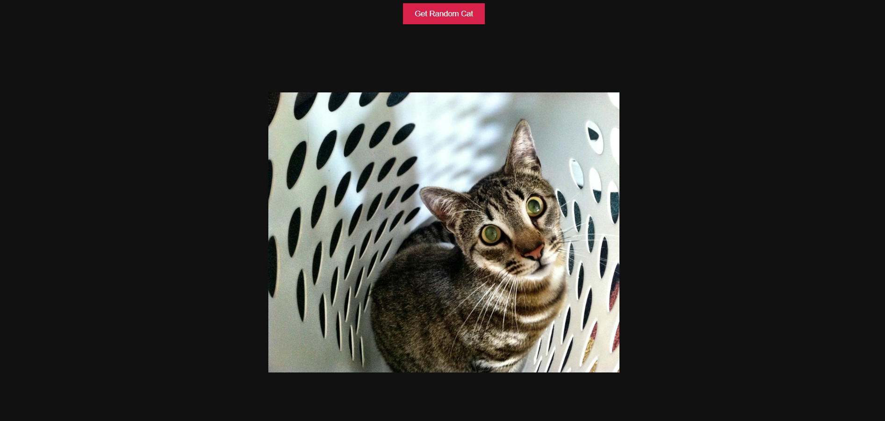

# Cat Image Generator

Cat Image Generator built using HTML, CSS, and JavaScript.



## Overview

A small, client-side web project that generates random cat images (or displays provided cat images) using plain HTML, CSS, and JavaScript. This repository is ideal as a learning project for beginners who want to practice DOM manipulation, asynchronous image loading, and simple UI design.

## Features

- Clean and minimal UI
- Generates and displays cat images using JavaScript
- Single-page app — no backend required
- Easily customizable styles and behavior

## Files

- `index.html` — Project HTML
- `style.css` — Styling
- `script.js` — JavaScript logic for generating/displaying images
- `Screenshot 2024-05-06 012928.png` — Screenshot used in this README

## How to use

1. Clone the repository:

```bash
git clone https://github.com/BinaryVortex/Cat-Image-Generator.git
```

2. Open `index.html` in your browser (double-click the file or use your browser's Open File).

3. Interact with the page to generate or view cat images.

## Development

- The project is plain static web code. You can edit `index.html`, `style.css`, and `script.js` and reload the page to see changes.
- To serve locally with a simple static server (optional):

```bash
# using Python 3
python -m http.server 8000
# then open http://localhost:8000
```

## Customization ideas

- Fetch random cat images from a public API (e.g., The Cat API)
- Add buttons to cycle through different categories or breeds
- Add animations or transitions when images load
- Add download/share functionality

## Contributing

Contributions are welcome! Feel free to open an issue or submit a pull request with improvements, bug fixes, or new features.

## License

This project is provided as-is. If you'd like to add an explicit license, include a `LICENSE` file (e.g., MIT) and I'll update the README.

---

Made with curiosity and a love of cats — enjoy!